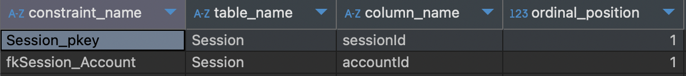
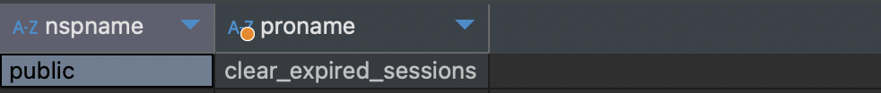

# PostgreSQL-practices
PostgreSQL personal cheatsheets, pratical examples and solutions, application layer integration and usage

## Navigation
* [CheatSheets](#cheatsheets)
  * [Constraints](#constraints)
  * [Stored procedures](#stored-procedures)


## CheatSheets

### Constraints
- Get constraints of a table
```sql
SELECT constraint_name, table_name, column_name, ordinal_position
FROM information_schema.key_column_usage WHERE table_name = 'tableName';
```


### Stored procedures

- Get stored procedures names
```sql
SELECT  nspname, proname 
FROM    pg_catalog.pg_namespace  
JOIN    pg_catalog.pg_proc  
ON      pronamespace = pg_namespace.oid 
WHERE   nspname = 'public' --- specify the schema anme
ORDER BY Proname;
```

- Get the inner SQL code of a procedure
```sql
SELECT prosrc FROM pg_proc WHERE proname = 'procedure_name';
```


- Get the full creation code of a procedure
```sql
SELECT pg_get_functiondef((
  SELECT oid FROM pg_proc
  WHERE proname = 'procedure_name'
));
```
