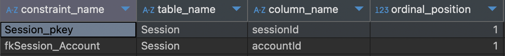
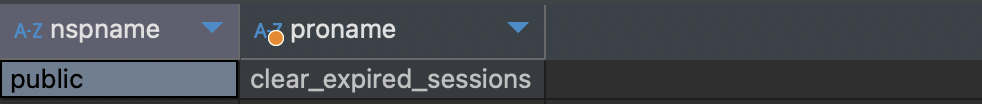

# PostgreSQL-practices
PostgreSQL personal cheatsheets, pratical examples and solutions, application layer integration and usage

## Navigation
* [CheatSheets](#cheatsheets)
  * [Constraints](#constraints)
    * [Get constraints of a table](#get-constraints-of-a-table)
  * [Stored procedures](#stored-procedures)
    * [Create a stored procedure](#create-a-stored-procedure)
    * [Get stored procedures names](#get-stored-procedures-names)
    * [Get the inner SQL code of a procedure](#get-the-inner-sql-code-of-a-procedure)
    * [Get the full creation code of a procedure](#get-the-full-creation-code-of-a-procedure)
  * [Stored procedures](#stored-procedures)
* [Extensions](#extensions)
  * [pg_cron](#pg_cron)
    * [Schedule a cronjob call](#schedule-a-cronjob-call)
    * [Installing via Docker](#installing-via-docker)


## CheatSheets

### Constraints
#### Get constraints of a table
```sql
SELECT constraint_name, table_name, column_name, ordinal_position
FROM information_schema.key_column_usage WHERE table_name = 'tableName';
```


### Stored procedures
#### Create a stored procedure
```sql
CREATE PROCEDURE clear_expired_sessions()
LANGUAGE SQL
AS $$
  DELETE FROM "Session" where expires <= Now();
$$;
```

#### Get stored procedures names
```sql
SELECT  nspname, proname 
FROM    pg_catalog.pg_namespace  
JOIN    pg_catalog.pg_proc  
ON      pronamespace = pg_namespace.oid 
WHERE   nspname = 'public' --- specify the schema anme
ORDER BY Proname;
```


#### Get the inner SQL code of a procedure
```sql
SELECT prosrc FROM pg_proc WHERE proname = 'procedure_name';
```


#### Get the full creation code of a procedure
```sql
SELECT pg_get_functiondef((
  SELECT oid FROM pg_proc
  WHERE proname = 'procedure_name'
));
```


## Extensions

### pg_cron
Link to the extension - https://github.com/citusdata/pg_cron
#### Schedule a cronjob call
```sql
SELECT cron.schedule('call-procedute-clear_expired_sessions', '1 * * * *', 'CALL clear_expired_sessions()'); --- every one minute
```

#### Installing via Docker
1. Prepare the [Dockerfile](/extensions/pg_cron/Dockerfile)
2. Create extension and grant access
```sql
CREATE EXTENSION pg_cron; --- connect extension to the db as a root
GRANT USAGE ON SCHEMA cron TO postgres; -- create as a specified user
```